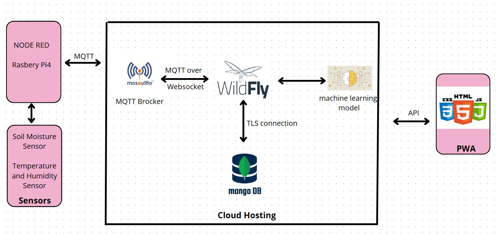

# Plant Health Monitoring System

This project was realized as part of an academic module to develop an innovative solution for monitoring plant health using IoT and AI technologies. The system aims to capture data from sensors, display it to users via a Progressive Web App (PWA), and provide AI-based insights into whether the environmental conditions are suitable for plant growth. Additionally, the system offers location-based services to direct users to the nearest agricultural centers.

## Created by:
- Adam Ben Rhaeim
- Amir Jribi
- Mohamed Saket

## Description

The **Plant Health Monitoring System** is designed to enhance agricultural efficiency and productivity. The PWA allows users to monitor key environmental parameters such as temperature, soil moisture, and humidity in real time. The AI model analyzes the collected data to determine if the conditions are favorable for plant growth. 

Moreover, the system incorporates a location-based feature that identifies the user’s location and suggests the nearest agricultural support centers for additional assistance.
## Architecture

---

## Technologies

### Backend and Middleware
- **Jakarta EE**: Backend framework for managing application logic.
- **MongoDB**: Database for storing sensor data and user information.
- **Mosquitto Broker**: MQTT message broker for IoT communication.
- **Vanilla JavaScript**: Client-side scripting.

### IoT Components
- **Arduino**: Microcontroller for sensor data acquisition.
- **DHT11 Sensor**: Captures temperature and humidity data.
- **Soil Moisture Sensor**: Measures soil water content.

### Frontend
- **PWA**: Progressive Web Application for real-time data visualization and interaction.

### AI Model
- Machine Learning model for environmental condition assessment.

---

## Frontend
- **PWA**: Progressive Web Application for real-time data visualization and interaction

## AI Model
- Machine Learning model for environmental condition assessment

## Installation guide

We made sure that the architecture of the repository was well organized for users to test the project locally or build on it. If you want to run the application locally, please follow the following steps:

    - Clone the repo: git clone https://github.com/Amir-Jribi/Fire-Detection
    - Install Wildfly30, with Java 21.
    - Install Nodered on your Raspberry pi and then load the content of embedded folder into your raspberry pi. Feel free to change the sensors and actuators pins, the MQTT broker, and the API link for getting a list of installed sensors.
    - Configure  HTTPS/HSTS for Wildfly.
    - Open microprofile.config.properties and set your settings (certificate path, MQTT broker settings, and you Mongodb link).
    - Move into the Health-monitoring directory and run nvm clean package to install the required dependencies.
    - Deploy the war file created in the target forlder in the deployment folder, and start your wildfly server. 
# Deployment Machine
The Application is also hosted on a virtual machine accessible at https://planthealth.me/
With our school mail, we can get a 100$ voucher inside of Microsoft Azure. With this voucher, we can create a virtual machine capable of hosting the middleware, the mosquitto broker and the database. The virtual machine have the following characteristics:
- Ram: 4GB
- vCPUS: 2
- Ressource disk size: 8GB
# Cerfitication and grading
We have enabled HTTPS with letsencrypt TLS certificate with HSTS enabled as well, ensuring only secure connections are allowed to the middleware.
Enabling TLS1.3 only on wildfly helps to generate A grading on SSLabs.

